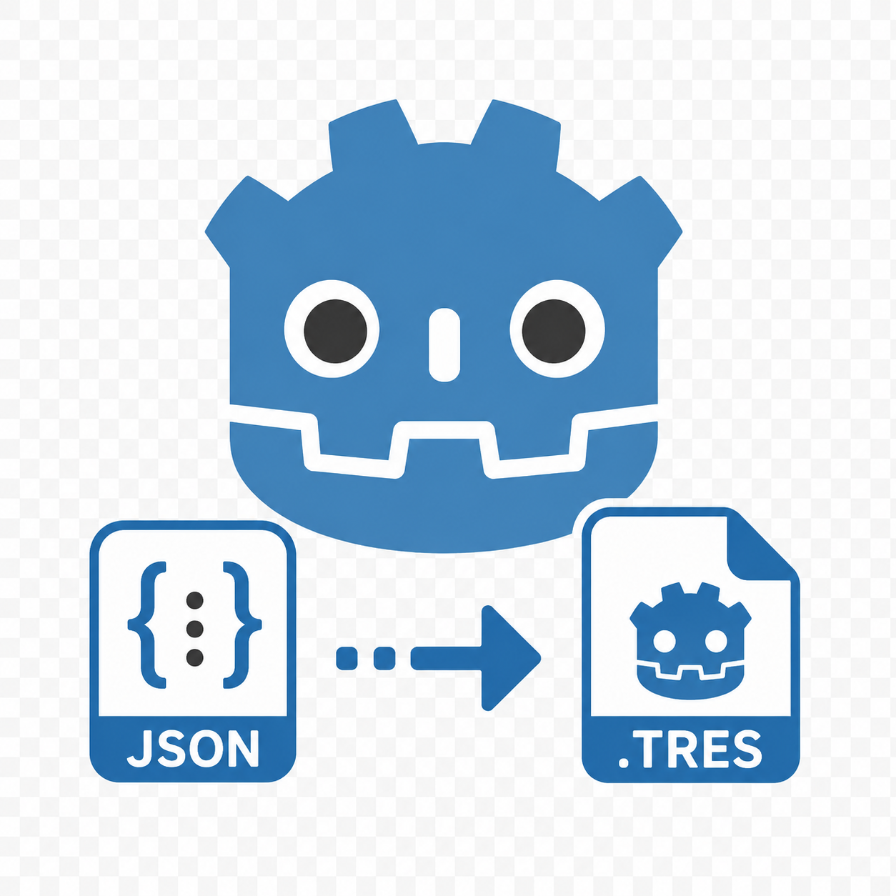

# ResourceJSON

<p align="center">
  
</p>
<p align="center">
  <!-- GitHub Actions Badge -->
  <a href="https://github.com/maxiking445/godot-resource-json/actions/workflows/CI.yml">
	
  </a>
 <br>

  
  
</p>

ResourceJSON is a lightweight Godot addon for converting Resources to JSON
and restoring them from JSON. Its goal is to make Resources easier to store,
exchange, inspect, and process.

## Installation and usage

Copy the `addons/jsonConverter/` directory into the `addons/` directory of your
Godot project. `JsonConverter.gd` declares the global class `JSONConverter`, so
you can use it from any GDScript without creating an instance or configuring an
autoload.

Convert a Resource to a JSON string:

```gdscript
var resource := preload("res://my_resource.tres")
var json := JSONConverter.stringify(resource)

# Optionally use spaces instead of the default tab indentation.
var formatted_json := JSONConverter.stringify(resource, "  ")
```

Restore a Resource from JSON:

```gdscript
var resource: Resource = JSONConverter.parse(json)
if resource == null:
	push_error("The JSON could not be converted to a Resource.")
```

The generic `convert()` method chooses the direction based on its argument:

```gdscript
var json: String = JSONConverter.convert(resource)
var restored_resource: Resource = JSONConverter.convert(json)
```

If you do not want to use the global class name, preload the script explicitly:

```gdscript
const JsonConverter := preload("res://addons/jsonConverter/JsonConverter.gd")

var json := JsonConverter.stringify(resource)
var restored_resource := JsonConverter.parse(json)
```

All public methods are static, so `JSONConverter.new()` is not required. The
aliases `resource_to_json()` and `json_to_resource()` are also available if you
prefer more explicit method names.

## Development setup

The test dependency GUT is not committed to this repository and is not part of
the distributed addon. Install it locally with:

```sh
./install_GUT.sh
```

The script installs GUT into `addons/gut/`. This directory is ignored by Git.
By default, the branch compatible with Godot 4.7 is used. To install a specific
GUT tag or commit instead, set `GUT_REF`, for example:

```sh
GUT_REF=v9.6.0 ./install_GUT.sh
```

This command installs GUT and then runs all configured tests. The installation
logic is included directly in the root-level `install_GUT.sh` script, so no
installer file is kept inside `addons/gut/`.
